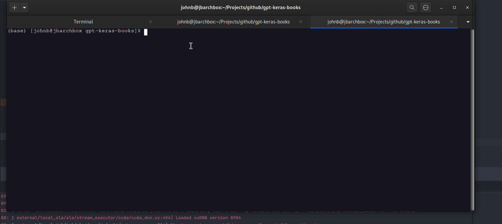

# (in progress) A GPT model based on simplebooks dataset

`SimpleBooks: Long-term dependency book dataset with simplifiedEnglish vocabulary for word-level language modeling` (Huyen Nguyen, 2019)

## Service in Streamlit and Docker
## Why Keras?
### The newest Keras (3.0.0) works with many platforms (jax, tensorflow, pytorch)
### and has some great tools and libraries for GPT and transformers, and NLP. 
## System Requirements:
* bash
* tested with python 3.10.10
* make
* python venv

## Python Requirements:
* Keras 3
* Tensorflow 2.15.0
* keras_nlp
* Flask
* Uvicorn
* Pydantic

### To build artefacts from scratch continue below. 
### Scroll down for docker instructions and running app without building model.
### <i>1) Model build instructions with make:</i> 

**********************************************************************
    make help
    make get_data
    make clean_data
    make dependencies
    make train 

**********************************************************************

### <i>To build and deploy app</i>
**********************************************************************

    make docker
    make start_apps
**********************************************************************

### <i>2) Pull prebuilt app</i>
**********************************************************************

    docker pull johnb340/book-gpt:v1
    make run_api
**********************************************************************

